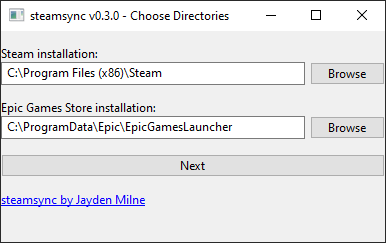
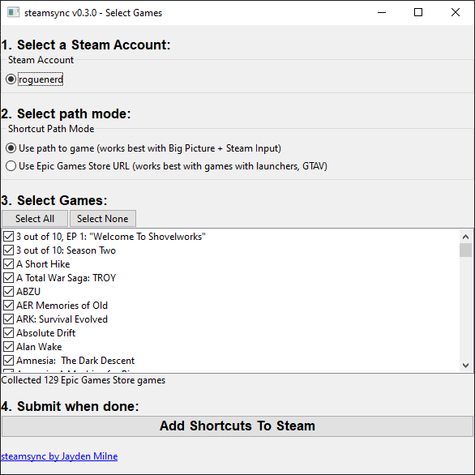

# steamsync

steamsync is an app to import your Epic Games Store games into Steam as shortcuts,
to allow you to use Remote Play and Steam Input with your EGS library.

You can either use the app, described below, or the [CLI version](steamsync-library/README.md) 
(available on PIP) if you are the ultimate hackerman.

## Using The App
### Installation
Head over to [the latest release](https://github.com/jaydenmilne/steamsync/releases/latest) and 
grab the latest `.exe`, and run it. There is no need to install anything.

### Usage
1. Download & run the app
2. Change the paths to your Steam installation and your Epic Games Store installation,
   if needed.
3. Press "Next"
4. Select the Steam Account and path mode you want (if you're not sure, leave
   the path mode at the default)
5. Exit Steam
6. Press "Add Shortcuts To Steam"
7. ???
8. Profit!

### Screenshots

It's beautiful, I know.

### FAQ
#### It doesn't work! / I can't get it to work!
[Open an issue on GitHub.](https://github.com/jaydenmilne/steamsync/issues)

#### Steam crashed after opening my library the first time, but worked after that
I think this has to do with importing all of the icons. Let Steam think and do 
its thing, eventually it will start responding again.

### What type of paths do I want?

You can either use the path to the game 
(eg `G:\Epic Games\RiME\RiME\SirenGame\Binaries\Win64\RiME.exe`) or use a URI 
to launch the game (`com.epicgames.launcher://apps/Hydrangea?action=launch&silent=true`).

Using the path is best when you want to do Remote Play and Steam Input.

The URI is required for some online games (eg GTAV) to work. This interferes with
Remote Play and Steam Input, however.

### I can't launch GTAV!

Use the "URI" option to import, see above.

#### I want to go back to the way it was
steamsync will backup your `shortcuts.vdf` file by default every time you run it.

Go to `C:\Program Files (x86)\Steam\userdata\{your steam userid}\config`. You will see some
`shortcuts.vdf-DATE.bak` files. Delete `shortcuts.vdf` (this is the one steamsync modified),
and rename the `.bak` file you want to use to `shortcuts.vdf`, restart steam. 

#### I got a `could not find shortcuts file at ...` error
Try making a shortcut in Steam (Library ➡ ➕ Add Game ➡ Add a Non-Steam Game...) first. 
steamsync will not make a `shortcuts.vdf` file for you if it isn't already there.

## Contributing

I welcome any PRs or suggestions on how to do better! The GUI is a mess, so if 
anyone wants to tidy up the layout or code, be my guest. Contributions are
licensed under the AGPLv3 license.